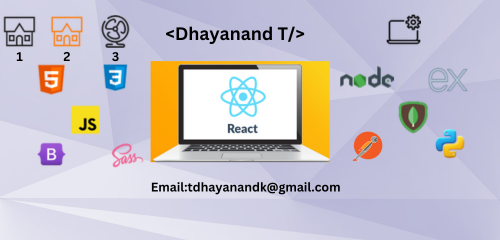

## Hi there 👋 It's me Dhayanand T
</a>
==Software Engineer== 

- 🔭 Here's my [portfolio](https://folio-mousse-ad2125.netlify.app/)   
- 📫 Please email via tdhayanandk@gmail.com to reach me.
- 🌱 I’m currently learning Mutual fund
- 💬 Ask me about anything, I am happy to help.
- 🤔 I’m looking for ?
- 💬 Ask me about Tech
- 📫 How to reach me :
   

# My Education 📖

| S.No | Degree | School/College | Specialization | Percentage to CGPA |
| ----- | --------- | ---------------------------- | ------------------------- | --------- |
| 1 | 10th | Sri Sowdeswari Matric Higher Secondary School IN Salem | SSLC | 64% |
| 2 | Diploma | Thiagarajar Polytechnic College | Computer Engineering | 85% |
| 3 | B.E | Sona College Of Technology | Computer Science and Engineering | 7.75 |

## Skilled in

### Languages:

  ---

### Web Development (Full-stack):

#### Frontend/UI

---

#### Backend/Server:

---

#### DataBase:

---

### API

---

## Hosting & Deploy

---

### IDE and Tools I Use
   

